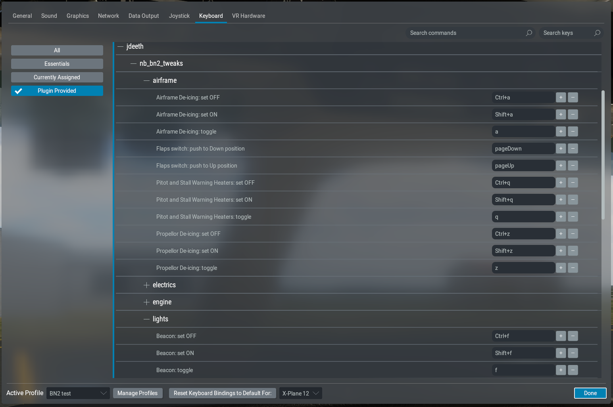

# Nimbus BN-2 Islander Tweaks

This is a strictly unofficial Rust plugin for the Nimbus BN-2 Islander for X-Plane 11/12.

https://store.x-plane.org/BN-2B-Islander_p_1243.html

It provides additional commands to facilitate hardware integration:



It also provides animation datarefs for the fuel pump switches which are missing in v2.1.

Most or all of this plugin will become redundant when Nimbus release v2.2, but it's useful
for me to get more practice making Rust plugins... some of the stuff included here (the
`ThirdPartyDataref` and `UpdateLoop` handlers) are hopefully gonna be useful in future
projects with a little more work.

## Commands

Switches have On, Off, and Toggle commands

### Engine
- Magneto switches
- Fuel pump switches

### Airframe
- Pitot & stall warning heater switch
- Airframe de-icing switch
- Propellor de-icing switch
- Flaps switch - this is spring-loaded to neutral. Keep the key/button held down to hold the switch.

### Lights
- Nav lights switch
- Landing lights switches
- Cabin lights switch
- Passenger notices switch
- Beacon light switch

### Electrics
- Generator switches
- Battery switch
- External Supply (starter isol) switch

## Fuel pump switches

In v2.1 of the Islander, the datarefs that animate the fuel pump switches were missing. The switches
work in that you can click on them to turn the fuel pumps on and off, but they'd just always be
drawn in the OFF position.

This plugin adds those datarefs, with a smoothing mechanism so they move over 1/10th of a second or so.

If you've modified `IslanderInterior_panel_ALB.obj` to use the `value_aux_fuel_x` datarefs,
change it back to use `anim_aux_fuel_x` (or restore the backed-up file... you backed it up,
right?).

If you've got a separate script to update the `anim_aux_fuel_x` datarefs, you should remove it
 - this plugin has the switches move over 0.1 seconds, rather than snap instantly, which in a
small way makes the switch feel more real.

The animation is over-engineered to take 0.1 in-game seconds rather than 0.1 real-world seconds, which
means the switches don't move when the sim is paused, and move 4x as fast if you're running at 4x speed.

## Installation (Windows)

Download the latest [Release](https://github.com/JDeeth/nb_bn2_tweaks/releases)

Copy the `nimbus-bn2-tweaks` folder into the Islander's `Plugins` folder

To confirm the plugin is running, load the aircraft and open Plugins > Show Plugin Admin.
The version and compilation date will be shown under Information > Nimbus BN2 Tweaks and
the additional commands should be visible in the control config.

## Build instructions

To build from source (and for Mac/Linux), clone this repo on a computer with Rust installed:

```
cargo build --release
```
Rename the `nb-bn2-tweaks.dll`/`.so`/`dylib` to `.xpl`

Place it in your DR400 plugins folder [as per the X-Plane SDK](https://developer.x-plane.com/article/building-and-installing-plugins/)

The `release.bat` file automates these steps (for my setup - customise as required!)

## Future

It should be possible to replace this with a generic "Commands to datarefs"
plugin which would be configured with a text file and provide standardised sets
of commands for pushbuttons, toggle switches, and multiposition switches.

Linux and/or Mac plugins could be provided if there's any demand for it.