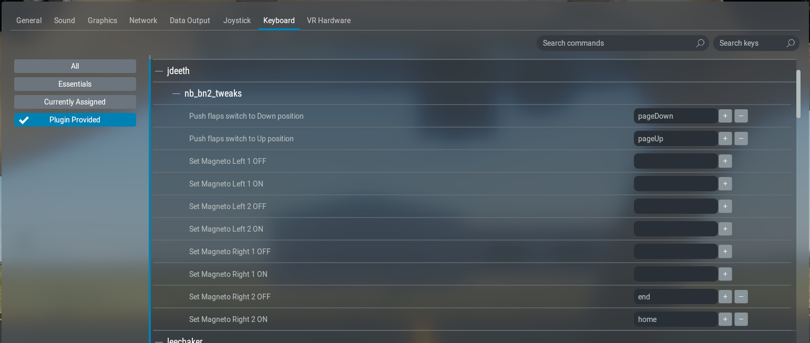

# Nimbus BN-2 Islander Tweaks

This is a strictly unofficial Rust plugin for the Nimbus BN-2 Islander for X-Plane 11/12.

https://store.x-plane.org/BN-2B-Islander_p_1243.html

It provides the following commands to facilitate hardware integration:



### Flaps
- `jdeeth/nb_bn2_tweaks/hold_flaps_switch_up` and `_down`

### Magnetos
- `jdeeth/nb_bn2_tweaks/mag_left_1_up`/`_down` to `mag_right_2_up`/`_down`

### Todo
- Fuel pump switches
- All the custom light switches
- Pitot heat controls
- Ice protection controls
- Starter isolation switch

## Installation (Windows)

Copy the `nimbus-bn2-tweaks` folder from `compiled` to your Islander `plugins` folder

To confirm it's running, load the aircraft and open Plugins > Show Plugin Admin.
The compilation date will be shown under Information > Nimbus BN2 Tweaks

## Build instructions

```
cargo build --release
```
Rename the `nb-bn2-tweaks.dll`/`.so`/`dylib` to `.xpl`

Place it in your DR400 plugins folder [as per the X-Plane SDK](https://developer.x-plane.com/article/building-and-installing-plugins/)

The `release.bat` file automates these steps (for my setup - customise as required!)

## Future

It should be possible to replace this with a generic "Commands to datarefs"
plugin which would be configured with a text file and provide standardised sets
of commands for pushbuttons, toggle switches, and multiposition switches.